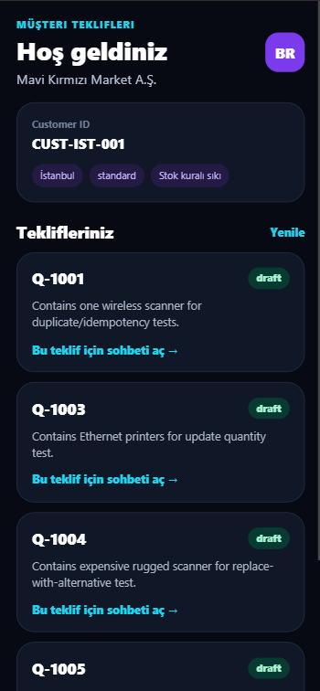
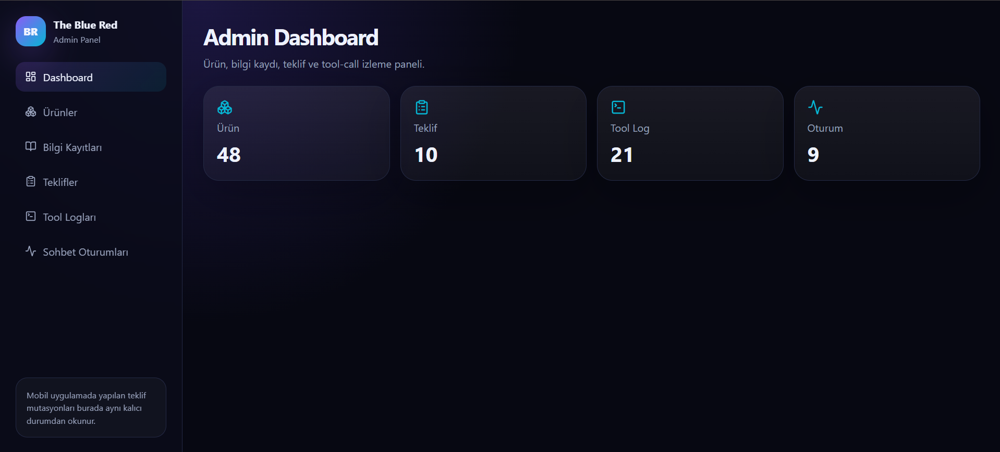

# The Blue Red – AI-Powered Proposal Assistant

## Screenshots

### Mobile Application



### Web Admin Dashboard



## Overview

The Blue Red AI-Powered Proposal Assistant is a full-stack B2B sales platform that enables customers to manage quotations through a conversational interface.

Customers interact with a React Native mobile application and ask questions about products, pricing, stock availability, compatibility, delivery, warranty, and company policies. The system retrieves relevant product and knowledge sources, generates grounded responses, and performs real quotation mutations when required.

All quotation changes are persisted in PostgreSQL and immediately visible in both the mobile application and the web administration panel.

This project was developed according to the requirements defined in the The Blue Red case study. The system supports deterministic fallback operation when no LLM is available and follows strict business rules regarding stock, pricing, idempotency, and quotation management.

---

## Architecture

```text
┌──────────────────────────┐
│ React Native Mobile App  │
└────────────┬─────────────┘
             │
             ▼
┌──────────────────────────┐
│ FastAPI Streaming API    │
│ (SSE Chat Endpoint)      │
└────────────┬─────────────┘
             │
     ┌───────┴────────┐
     ▼                ▼
┌──────────┐   ┌──────────────┐
│ Tool     │   │ Retrieval    │
│ Router   │   │ Engine       │
└────┬─────┘   └──────┬───────┘
     ▼                ▼
┌──────────┐   ┌──────────────┐
│ Quote    │   │ Knowledge    │
│ Mutations│   │ & Products   │
└────┬─────┘   └──────┬───────┘
     └────────┬───────┘
              ▼
      PostgreSQL Database

              ▲
              │
┌──────────────────────────┐
│ React Admin Dashboard    │
└──────────────────────────┘
```

---

## Technology Stack

### Backend
- FastAPI
- PostgreSQL
- SQLAlchemy
- Docker Compose
- Server Sent Events (SSE)

### Web Admin
- React
- Vite

### Mobile Application
- React Native
- Expo

### AI & Retrieval
- OpenAI Tool Calling (optional)
- Deterministic Fallback Mode
- TF-IDF Retrieval
- Cosine Similarity Ranking

---

## Core Features

### Product Search
Searches products using:

- Product name
- Turkish aliases
- Category
- Tags
- Stock status
- Price limits

### Knowledge Retrieval
Returns grounded information for:

- Warranty
- Returns
- Delivery
- Pricing policies
- Stock policies
- Compatibility rules

Every policy response includes at least one knowledge source reference.

### Shared Quote State

Both mobile and web applications operate on the same quote.

Supported operations:

- Read quote
- Add item
- Update quantity
- Replace with alternative

### Streaming Chat

The chat endpoint streams:

- Session start
- Tool execution events
- Tool results
- Sources
- Text chunks
- Final completion event

### Tool Logs

Every tool execution is logged and viewable through the admin panel.

---

## Supported Tool Contracts

### search_products

Find products using:

- Keywords
- Turkish aliases
- Categories
- Tags
- Price limits
- Stock availability

### get_knowledge_entries

Returns grounded knowledge entries.

### get_quote

Reads the current quotation state.

### add_to_quote

Adds a product or increases quantity if it already exists.

### update_quote_item

Updates item quantity.

### replace_with_alternative

Replaces an item with a valid alternative while preserving quote history.

---

## Business Rules

### Price Limit Enforcement

User-defined maximum prices are treated as hard constraints.

Products exceeding the limit:

- Cannot be recommended
- Cannot be automatically added
- Cannot be used during replacement operations

### Stock Rules

Out-of-stock products are not recommended by default.

Exception:

- Customer allows backorders
- User explicitly accepts waiting

### Grounded Responses

Policy and compatibility answers always include knowledge sources.

### Duplicate Prevention

Adding the same product again:

- Does not create a second active row
- Increases quantity instead

### Idempotency

Requests with the same idempotency key:

- Execute only once
- Prevent duplicate quote mutations

---

## Retrieval Strategy

### Selected Approach

Hybrid Retrieval:

1. Structured database filtering
2. TF-IDF ranking
3. Cosine similarity scoring

### Why This Approach?

Advantages:

- Fast
- Deterministic
- Easy to test
- Works without external AI services
- Suitable for small and medium product catalogs

---

## Tool Orchestration

### AI Mode

When an API key is available:

1. User message is analyzed.
2. Appropriate tool calls are selected.
3. Tool results are grounded into the final answer.

### Fallback Mode

When no API key exists:

1. Intent is detected deterministically.
2. Retrieval is performed.
3. Safe responses are generated.
4. No unsafe mutations occur.

This guarantees uninterrupted system operation.

---

## Quote Mutation Model

### Add

Creates a new item or increases quantity.

### Update

Modifies existing quantity.

Quantity = 0 can be:

- Soft-deleted
- Marked inactive

### Replace

Original item becomes:

- Replaced
or
- Inactive

Replacement item becomes active.

This preserves quote history.

---

## Web Administration Panel

Features:

- Dashboard
- Product Management
- Knowledge Management
- Quote Viewer
- Tool Logs
- Chat Sessions

Administrators can observe mutations made through the mobile application in real time.

---

## Mobile Application

### Login Screen

Customer enters username.

### Home Screen

Displays available quotations.

### Chat Screen

Supports:

- Streaming responses
- Tool progress tracking
- Sources
- Quote updates

### Quote Preview

Read-only quotation summary.

---

## Running the Project

### Clone Repository

```bash
git clone <repository-url>
cd project
```

### Environment Variables

```bash
cp .env.example .env
```

Configure:

```env
DATABASE_URL=...
OPENAI_API_KEY=...
```

### Start Services

```bash
docker compose up --build
```

---

## Test Execution

Run:

```bash
pytest -q
```

Expected coverage areas:

- Retrieval
- Grounding
- Tool selection
- Quote mutations
- Idempotency
- Price rules
- Stock rules
- Fallback mode
- Shared quote state

---

## Known Limitations

- TF-IDF retrieval is optimized for the provided dataset and may require improvements for larger catalogs.
- No vector database integration.
- Limited multilingual retrieval support.
- Deterministic fallback focuses on predefined business scenarios.
- Advanced recommendation ranking is not implemented.

---

## AI Usage

AI is used only for:

- Tool selection
- Grounded response generation

All business-critical mutations are validated by backend rules before database persistence.

The system remains functional without AI through deterministic fallback logic.

---

## Project Requirements Coverage

This implementation addresses:

- Grounded retrieval
- Streaming chat
- Tool-call mutations
- Idempotency
- Shared quote state
- Admin visibility
- Fallback operation
- Docker deployment
- PostgreSQL persistence
- Web + Mobile integration

---

## Author

Sooad Shhadah

Computer Engineering Student

Hasan Kalyoncu University
